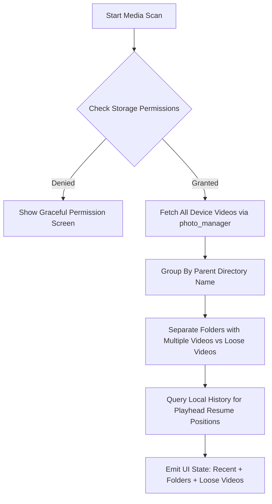
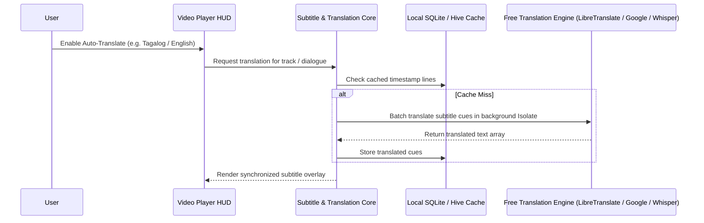

# 🎬 CinemaFlow — Ad-Free Modern Video Player
> **Vision:** A clean, zero-ads, high-performance, and beautifully crafted mobile & desktop video player with smart folder organization, resume playback, gesture controls, and free automated translation.

---

## 📑 Table of Contents
1. [Project Overview & Core Principles](#1-project-overview--core-principles)
2. [High-Level Architecture](#2-high-level-architecture)
3. [UI / UX Design Blueprint](#3-ui--ux-design-blueprint)
   - [Landing / Home Page Hierarchy](#landing--home-page-hierarchy)
   - [Player Screen Design](#player-screen-design)
4. [Data Layer & Business Logic](#4-data-layer--business-logic)
   - [Media Scanning & Folder Categorization Algorithm](#media-scanning--folder-categorization-algorithm)
   - [Watch History & Resume Logic](#watch-history--resume-logic)
5. [Auto-Translation Subsystem (Future-Proof Roadmap)](#5-auto-translation-subsystem-future-proof-roadmap)
6. [Tech Stack & Package Ecosystem](#6-tech-stack--package-ecosystem)
7. [Step-by-Step Implementation Roadmap](#7-step-by-step-implementation-roadmap)

---

## 1. Project Overview & Core Principles

Commercial video players (MX Player, VLC clones) are plagued by intrusive interstitial ads, banner ads, and slow bloatware. **CinemaFlow** solves this with three pillars:
* 🛡️ **100% Ad-Free Forever:** Zero ad SDKs, zero telemetry bloat, zero background trackers.
* ⚡ **Performance First:** 60/120 FPS UI, asynchronous thumbnail decoding, and hardware-accelerated playback.
* 🎨 **Aesthetic Excellence:** OLED dark theme, frosted glassmorphism overlays, smooth micro-interactions, and modern typography.

---

## 2. High-Level Architecture

We adhere strictly to **Clean Architecture** with separation of concerns:

```
lib/
├── app/
│   ├── theme/               # Dark OLED colors, typography, glassmorphism tokens
│   └── routes/              # App navigation & route transitions
├── core/
│   ├── constants/           # Storage keys, player constants
│   ├── errors/              # Failure handling & exception mapping
│   └── utils/               # Time formatters, file size helpers, thumbnail generators
├── data/
│   ├── datasources/         # Device storage scanner, local database (Hive/Isar)
│   ├── models/              # VideoItemModel, MediaFolderModel, WatchHistoryModel
│   └── repositories/        # MediaRepositoryImpl, HistoryRepositoryImpl
├── domain/
│   ├── entities/            # VideoItem, MediaFolder, WatchHistory
│   └── repositories/        # MediaRepository contract, HistoryRepository contract
└── presentation/
    ├── home/                # Home dashboard, Continue Watching, Folders, Loose Videos
    ├── folder_detail/       # Videos inside selected folder
    ├── player/              # Fullscreen player, gesture controller, overlay HUD
    └── widgets/             # Reusable cards, badges, modal dialogs
```

---

## 3. UI / UX Design Blueprint

### Landing / Home Page Hierarchy

The Home Page follows the user-specified **"Hierarchy of Focus"**:

```
┌────────────────────────────────────────────────────────┐
│  [Top Bar]  CinemaFlow 🎬             🔍 [Search] ⚙️   │
├────────────────────────────────────────────────────────┤
│  [Section 1: Continue Watching / Recent Plays]         │
│  • Horizontal swipeable cards                          │
│  • Video thumbnail with gradient shadow                │
│  • Linear progress bar (e.g., 62% watched)             │
│  • Remaining duration badge (e.g., "14m left")         │
│  • One-tap instant resume                              │
├────────────────────────────────────────────────────────┤
│  [Section 2: Folders & Albums (First Priority)]        │
│  • Section header: "Folders (N)"                       │
│  • Grid / Carousel of detected directories:            │
│    ┌──────────────┐  ┌──────────────┐                  │
│    │ 📁 Movies    │  │ 📁 Camera    │                  │
│    │ 12 Videos    │  │ 48 Videos    │                  │
│    └──────────────┘  └──────────────┘                  │
│  • Tap opens full folder file list                     │
├────────────────────────────────────────────────────────┤
│  [Section 3: Loose / Standalone Videos]                │
│  • Section header: "All Videos (N)"                    │
│  • Videos located in root or ungrouped directories     │
│  • List item components:                               │
│    - Thumbnail with length badge (e.g. 10:45)          │
│    - Title, file size (MB/GB), date modified           │
│    - 3-dots action menu (Info, Share, Delete)          │
└────────────────────────────────────────────────────────┘
```

---

## 4. Data Layer & Business Logic

### Media Scanning & Folder Categorization Algorithm



### Data Models

```dart
class VideoItem {
  final String id;
  final String path;
  final String title;
  final Duration duration;
  final int sizeInBytes;
  final String parentFolder;
  final DateTime modifiedDate;
  final String? thumbnailPath;
}

class MediaFolder {
  final String folderName;
  final String folderPath;
  final List<VideoItem> videos;
  int get count => videos.length;
}

class WatchHistory {
  final String videoPath;
  final Duration lastPosition;
  final Duration totalDuration;
  final DateTime lastWatchedAt;
  double get progressPercentage => 
      totalDuration.inMilliseconds > 0 
          ? (lastPosition.inMilliseconds / totalDuration.inMilliseconds).clamp(0.0, 1.0)
          : 0.0;
}
```

---

## 5. Auto-Translation Subsystem (Future-Proof Roadmap)



---

## 6. Tech Stack & Package Ecosystem

| Purpose | Recommended Package | Why It's the Industry Standard |
| :--- | :--- | :--- |
| **Playback Engine** | `media_kit` + `media_kit_video` | Built on libmpv; plays any codec (MKV, MP4, FLV, AVI), HW acceleration. |
| **Media Library Scan**| `photo_manager` | High performance, handles Android 13+ Scoped Storage seamlessly. |
| **State Management** | `flutter_riverpod` or `provider` | Reactive, decoupled, testable, and eliminates boilerplate. |
| **Local Storage** | `hive_flutter` or `shared_preferences` | Extremely fast key-value database for timestamps and resume states. |
| **Icons & Design** | `lucide_icons` or `fluentui_system_icons` | Ultra-clean, modern, minimalist aesthetics. |

---

## 7. Step-by-Step Implementation Roadmap

- [x] **Step 1: Project Setup & Dependencies**
  - [x] Configure `pubspec.yaml` with chosen dependencies.
  - [x] Setup Android permissions (`READ_MEDIA_VIDEO`, `WAKE_LOCK`).
- [x] **Step 2: Design System & Theme Foundation**
  - [x] Implement dark OLED color palette, typography, glassmorphism cards, and badge components.
- [ ] **Step 3: Storage Scanner & Repository Implementation**
  - Build `MediaRepository` to scan device videos.
  - Implement grouping logic: Folders list vs Loose videos.
- [ ] **Step 4: Continue Watching & Local History Store**
  - Build local storage service to save and retrieve playhead positions.
- [x] **Step 5: Home Page UI Assembly**
  - [x] Top Bar (Instant Search + Settings).
  - [x] Horizontal Continue Watching carousel with progress bar & remaining time.
  - [x] Folders First 2-column Grid with video counters.
  - [x] Standalone / Loose Videos List with metadata badges.
- [ ] **Step 6: Folder Details Page**
  - Browse videos specific to a tapped folder.
- [ ] **Step 7: Video Playback Screen & Gesture Controls**
  - Fullscreen media_kit integration.
  - Vertical swipe brightness & volume; horizontal swipe seek; double-tap seek ripple.
- [ ] **Step 8: Auto-Translate Engine Integration**
  - Subtitle parser & free translation connector.
